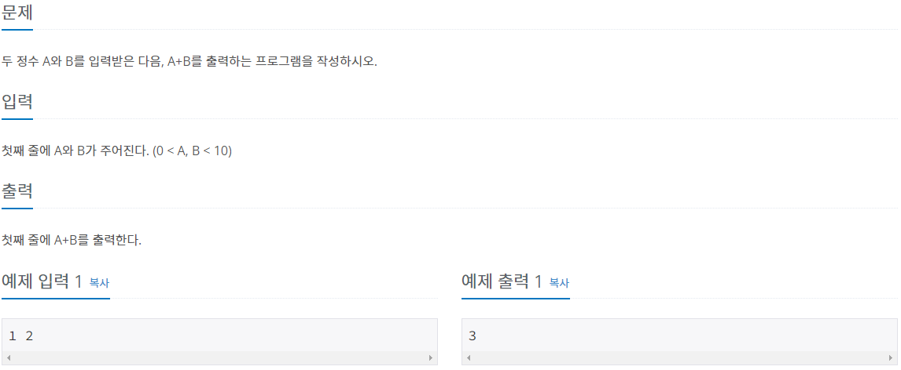
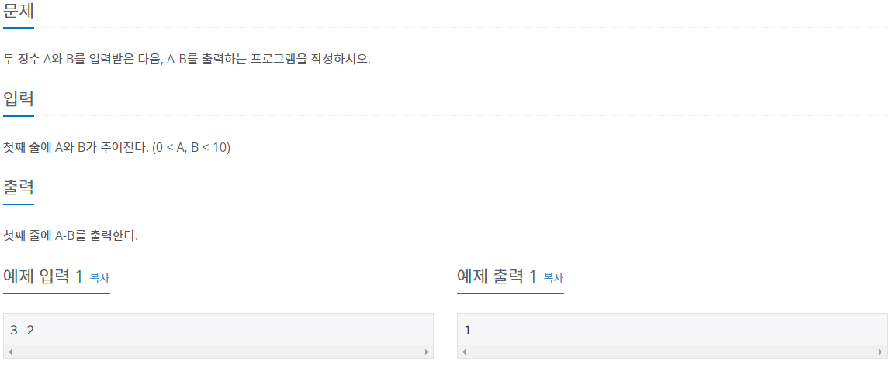

# 1000번




```python
# 한 줄에서 입력 받아야 하므로 map(함수, iterable)함수 쓰기
# split 메소드는 입력받은 값을 리스트로 반환
A,B = map(int, input().split())

print(A+B)
```


# 1001번




```python
A,B = map(int,input().split())
print(A-B)
```

