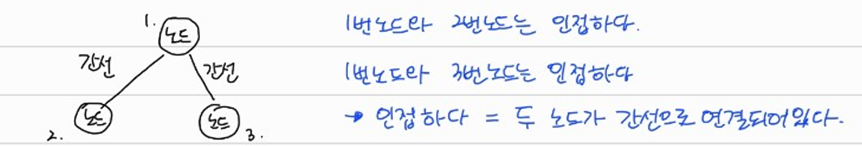

### 📗 리스트 실습문제

---

#### 1️⃣ 6485_삼성시의 버스노선

```python
T = int(input())
for tc in range(1,T+1) :
    # 노선 수
    N = int(input())

    # 노선 정보 받기
    inf_lst = []
    for _ in range(N) :
        inf_lst.append(list(map(int,input().split())))
    # print(inf_lst)

    # 정류장 갯수
    P = int(input())
    for _ in range(P) :
        int(input())
   
    ans_lst = [0] * (P+1)
    for i in inf_lst :
        a = i[0]
        b = i[1]
        while a <= b :
            ans_lst[a] += 1
            a += 1
    print(f'#{tc}', *ans_lst[1::])
```

> 런타임 에러가 나는 코드


#### 2️⃣ 1979_어디에 단어가 들어갈 수 있을까

```python
import sys
sys.stdin = open('input.txt','r')

T = int(input())
for tc in range(1,T+1) :
    # N은 퍼즐의 길이, K는 단어의 길이
    N, K = map(int,input().split())
    arr = [list(map(int,input().split())) for _ in range(N)]

    # 배열 내부에 1에 단어가 들어갈 수 있음.
    ans = 0

    sum_arr = [[0]*N for _ in range(N)]
    # 가로줄 탐색
    for i in range(1,N):
        for j in range(1,N):
            if arr[i][j] == 1 :
                sum_arr[i-1][j-1] += arr[i-1][j-1]
            elif arr[i][j] == 0 :
                continue

            if max(sum_arr[i]) == 3 :
                ans += 1


    # 세로줄 탐색
    for j in range(N):
        for i in range(N):
            if arr[i][j] == 1 :
                sum_arr[i-1][j-1] += arr[i-1][j-1]
            elif arr[i][j] == 0 :
                continue
            if max(sum_arr[i]) == 3:
                ans += 1


    print(ans)
```

> 아직 답이 안나와서 다시 해봐야겠다..


### 📕 DFS (깊이 우선 탐색)

- 먼저, 그래프의 기본 구조 알기

  

- 그래프 표현 방식

  - 인접 행렬 (2차원배열 이용)

    - 인접한 곳은 1, 아닌 곳은 0 표시하기

      ```python
      [[0,1,1], [1,0,0],[2,0,0]]
      ```

  - 인접 리스트 (리스트 이용)

    - 해당 노드의 인덱스를 이용해 인접 표현하기

      ```python
      [[],[2,3],[1],[1]]
      ```

- 재귀함수 : 자기 자신을 다시 호출하는 함수

  - Recursin Error : 재귀의 최대 깊이를 초과 했을때 나오는 에러
  - **종료조건** 필수로 명시해야함. 보통 함수 내부의 첫째줄에 종료조건이 온다.
  - 컴퓨터 내부에서 재귀함수의 수행은 **스택** 자료구조를 이용 한다.
    - why? 함수를 계속 호출했을 때, **마지막에 호출한 함수가 return** 되어야 그 앞의 함수 호출이 종료되기 때문
  - 수학의 점화식을 그대로 소스코드로 옮겼기 때문에, 반복문보다 재귀가 유리한 경우가 있다.

- dfs 동작과정

  1. 탐색 시작 노드를 스택에 삽입하고 방문처리를 한다.
  2. 스택의 최상단 노드에 방문하지 않은 인접 노드가 있으면, 그 인접 노드를 스택에 넣고 방문 처리를 한다. 방문하지 않은 인접 노드가 없으면, 스택에서 최상단 노드를 꺼낸다.
  3. 2번의 과정을 더 이상 수행할 수 없을 때 까지 반복한다.

  **dfs 코드**

  ```python
  '''
  1 2 1 3 2 4 2 5 4 6 5 6 6 7 3 7
  '''
  
  user_input = list(map(int,input().split()))
  
  # 인접리스트 만들기
  graph = [[] for _ in range(8)] # 노드의 가장 큰 숫자 +1
  for i in range(7):             # len(user_input) // 2 - 1 
      n1, n2 = user_input[i*2], user_input[i*2+1]
      graph[n1].append(n2)
      graph[n2].append(n1)
  print(graph)                   # [[], [2, 3], [1, 4, 5], [1], [2, 6], [2, 6], [4, 5, 7], [6]]
  
  # 방문 처리 해 줄 리스트
  visited = [False]*8
  
  def dfs(v):                    # 1번 노드부터 시작해서
      visited[v] = True          # 방문한 노드를 방문처리 해준다.
      print(v, end=' ')          # 그리고 해당 노드를 출력
      for i in graph[v]:         # 인접리스트의 v번 인덱스(v==1일때, 노드 1의 인접 노드)를 순회하며 
          if not visited[i] :    # 방문하지 않았을 때,
              dfs(i)             # 해당 노드를 시작으로 함수를 호출함.
  
  dfs(1)
  ```

  


##### ✏ DFS 응용문제 ([BOJ] 2606. 바이러스)

~~~python
# 컴퓨터의 수
com = int(input())
# 간선 수
E = int(input())
# 인접리스트 만들기
lst = [[] for _ in range(com+1)]
for i in range(E):
    a, b = map(int,input().split())
    lst[a].append(b)
    lst[b].append(a)
print(lst)

# 방문 리스트
visited = [False] * (com+1)
cnt = 0

def dfs(v):
    global cnt
    visited[v] = True
    # print(v)

    for i in lst[v]:
        if not visited[i] :
            dfs(i)
            cnt += 1

dfs(1)
print(cnt)
~~~

##### ✏ DFS 응용문제 ([SWEA] 4871. 그래프 경로)

```python
T = int(input())
for tc in range(1,T+1) :
    V,E = map(int,input().split())    # V는 노드의 수 E는 간선의 수

    # 그래프 리스트 받기
    graph = [[] for _ in range(V+1)]
    for _ in range(E):
        a,b = map(int,input().split())
        graph[a].append(b)            # 유향 그래프
    print(graph)                      # 1번 tc의 경우 [[], [4, 3], [3, 5], [], [6], [], []]

    # 출발노드 S, 도착노드 G
    S,G = map(int,input().split())

    # 방문 확인
    visited = [False]*(V+1)
    # 정답 변수 초기화
    ans = 0
    def dfs(v):
        global ans
        visited[v] = True
        if v == G:
            ans = 1
            return

        for i in graph[v]:            # 이 부분에서 원하는 답이 없을때, 어떤것에 의해 return 되는건지..?
            if not visited[i]:
                dfs(i)

    dfs(S)
    print(f'#{tc}',ans)
```

