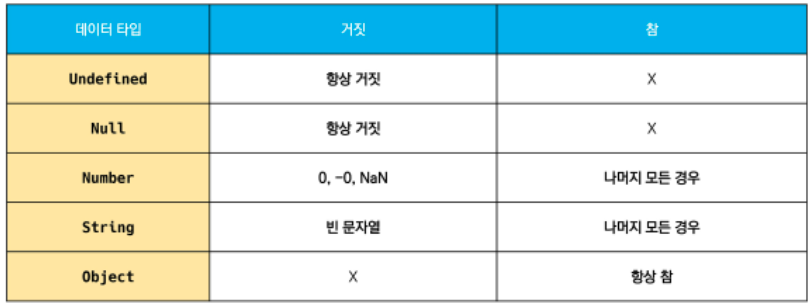
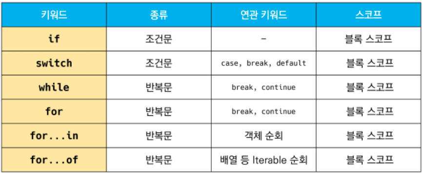

# JavaScript

> 브라우저 화면을 '동적'으로 만들기 위한, 브라우저를 조작할 수 있는 유일한 언어

- **DOM** : HTML, XML과 같은 **문서**를 다루기 위한 프로그래밍 인터페이스
  - 파싱 : 브라우저가 문자열을 해석하여 DOM Tree로 만드는 과정

- **BOM **: 자바스크립트가 **브라우저**와 소통하기 위한 모델


### 변수와 식별자


#### 식별자 

- 변수를 구분할 수 있는 변수명. 문자, 달러($), 밑줄(_)로 시작

- 대소문자 구분하며, 클래스명 외에는 모두 소문자로 시작함
- 예약어(for, if, function 등) 사용 불가능


#### 식별자 작성 스타일

- 카멜케이스(camelCase) : **변수, 객체, 함수**에 사용 (ex. articleCreate())
- 파스칼 케이스(PascalCase) : **클래스, 생성자**에 사용 (ex. class ArticleSerialzer)
- 대문자 스네이크 케이스(SNAKE_CASE) : **상수** (변경될 가능성이 없는 값)에 사용


#### 변수 선언 키워드 - let, const

> 2016년도 let, const 도입 후(es6)에는 var는 잘 사용하지 않음

1. **let **

   - 재할당 할 예정인 변수 선언 시 사용
   - 변수 재선언 불가능
   - 블록 스코프 : {}
     - if, for, 함수 등의 **중괄호 내부**를 가리킴. 블록 스코프를 가지는 변수는 블록 바깥에서 접근 불가능

   ```javascript
   let foo       // 선언
   foo = 11      // 할당
   let bar = 0   // 선언+할당
   let bar = 2   // 재선언 불가능 SyntaxError
   ```

2. **const**

   - 재할당 할 예정이 없는 변수 선언 시 사용 ( = 을 못쓴다)
   - 변수 재선언 불가능
   - 블록 스코프 : {}

   ```javascript
   const number = 10 // 선언 및 초기값 할당
   number = 10       // 재할당 불가능 -> Type Error
   const number = 20 // 재선언 불가능 SyntaxError
   ```

3. **var**
   
   - 재선언 및 재할당 모두 가능하지만, 호이스팅 되는 특성으로 사용하지 않는 것을 권장함
   - 호이스팅
     - 변수 선언 이전에 참조할 수 있는 현상. 변수 선언 이전의 위치에서 접근 시 undefined를 반환 (에러가 나지 않음)
   - 함수 스코프 : 함수 내에서 선언된 변수는 함수 내에서만 유효하다.


### 데이터 타입


#### 원시타입(Primitive type)

> Number, String, Boolean, null, undefined
>
> - 객체가 아닌 기본 타입
> - 변수에 해당 타입의 값이 담김
> - 다른 변수에 복사할 때 실제 값이 복사 됨

- **NaN** : 계산 불가능한 경우 반환되는 값 (에러 반환 x)
  - type(NaN) : number
- **String** : 텍스트 데이터를 나타내는 타입
  - 작은 따옴표, 큰 따옴표 모두 사용 가능
  - 템플릿 리터럴 : 백틱, ${expression} 형태로 표현 식 삽입 가능
- **undefined** : 변수의 값이 없음을 나타내는 데이터 타입
  - 변수 선언 이후 직접 값을 할당하지 않으면, **자동**으로 undefined가 할당됨

- **null** : 변수의 값이 없음을 **의도적**으로 표현할 때

  - type(null) : object

- **Boolean** : 논리적 참 또는 거짓(true or false)을 나타내는 타입

  - 조건문 또는 반복문에서 유용하게 사용

  - 자동 형변환

    

#### 참조타입(Reference type)

> Array, Function

- 객체 타입의 자료형
- 변수에 해당 객체의 참조 값이 담김
- 다른 변수에 복사할 때 참조 값이 복사됨


### 연산자


#### 할당 연산자

- ++ : 피연산자의 값을 1 증가시키는 연산자, -- : 피연산자의 값을 1 감소시키는 연산자

  > 다만, 더 분명한 표현인 +=, -= 로 적을 것을 권장함


#### 비교 연산자

- 동등 비교 연산자 (==) : 예상치 못한 결과가 발생할 수 있으므로 특별한 경우를 제외하고는 사용하지 않음

  ```javascript
  1 == '1'
  true
  ```

- **일치 비교 연산자 (===)** : 두 피연산자가 같은 값으로 평가되는지 비교 후 bool 값을 반환
  - **엄격한 비교(타입(자료형)과 값이 모두 같은 지 확인)**가 이루어짐
  - '다르다'는 (!==)로 표현함


#### 논리 연산자

- and : &&

- or : ||

- not : !

- 단축 평가 지원

  ```javascript
  false && true //false
  true || false // true
  ```

  

#### 삼항 연산자

> 콜론(:)으로 구분

- (표현식 ? x : y ) 
  - 표현식 맞아? yes -> x, no -> y


### 조건문


#### if 

> 조건은 소괄호 안에 작성. 실행할 코드는 중괄호 안에 작성

```javascript
const nation = 'Korea'

if (nation === 'Korea') {          // (이 부분에 조건이 들어옴)
    console.log('안녕하세요!')       // {여기에 실행할 코드}
} else if (nation === 'France') {
    console.log('Bonjour!')
} else {
    console.log('Hello!')
}
```


#### switch

> 표현식의 결과값을 이용한 조건문. 표현식의 결과값과  case문의 오른쪽 값을 비교
>
> 최근 python에도 비슷한 match라는 문법이 생김

```javascript
const nation = 'Korea'

swith(nation) {
    case 'Korea': {
        console.log('안녕하세요!')
        break                      // break가 있어야 멈춤. 아니면 나머지 구문 다 실행
    }
    case 'France': {
        console.log('Bonjour!')
        break
    }
    default: {
        console.log('Hello!')
    }
}
```


### 반복문


#### while

```javascript
let i = 0

while (i<6) {
    console.log(i) // 0, 1, 2, 3, 4, 5
    i++
}
```

- 조건문이 true일 동안 반복으로 시행
- 조건은 소괄호 안에, 실행할 코드는 중괄호에 작성


#### for

```javascript
for (initialization; condition; expression) {
    // do something
}

for (let i=0; i<10; i++) {   // 최초 i는 0, i가 10보다 작은지, i를 1씩 늘려라
    console.log(i)           // 0 1 2 3 4 5 6 7 8 9
} 
```

- initialization : 최초 반복문 진입 시 1회만 실행되는 부분
- condition : 매 반복 시행 전 평가되는 부분
- expression : 매 반복 시행 이후 평가되는 부분


#### for ... in

```javascript
for (variable in object) {
    // do something
}
```

- 객체(object,딕셔너리)의 속성(key)들을 순회할 때 사용
- 배열 순회는 권장하지 않음
  - 배열로 돌리면 인덱스가 출력됨


#### for ... of

```javascript
for (variable of iterables) {
    // do something
}
```

- 반복가능한(iterable) 객체를 순회 하며 값(value)을 꺼낼 때 사용




### 함수

> 참조타입 중 하나로써 function 타입에 속함
>
> JavaScript의 함수는 일급객체에 해당함
>
> 일급 객체란? 변수에 할당 가능, 함수의 매개변수로 전달 가능, 함수의 반환값으로 사용 가능


#### 함수 선언식

```javascript
function 함수명(매개변수) {
    코드
}
```

- 익명함수 사용이 불가능 하고, 호이스팅이 됨

#### 함수 표현식

```javascript
const 변수 = function (매개변수) {  
    코드
}
```

- 익명함수로 정의하여, 함수 자체를 변수에 할당


1. 기본 인자 : 인자 작성 시 '=' 문자 뒤 기본 인자 선언 가능

   ```javascript
   const greeting = function (name='Anonymous') {
       
   }
   ```

2. 매개변수와 인자의 개수 불일치 허용 

   - 인자의 개수가 많던 적던 에러 발생 안함

   ```javascript
   const sub = function (a,b) {
       return a-b
   }
   cosole.log(sub())     // 2. 앞의 인자로 계산하고 뒤에 언어로는 계산 안함
   ```

   - Rest Parameter (파이썬의 가변인자리스트)

   ```javascript
   const restArgs = function(a,b,...args) {
       console.log(args)
       return [a,b,args]
   }
   console.log(restArgs()) //[]
   console.log(restArgs(1,2)) // [1, 2, Array(0)]
   console.log(restArgs(1,2,'a','b','c')) // [1,2,Array(3)]
   ```

3. Spread operator (..., 파이썬의 언패킹(*))

   ```javascript
   const restOpr = function (a1, a2, ...restArg) {
       return [a1, a2, restArg]
   }
   
   restOpr(1,2,3,4,5) // [1,2,[3,4,5]]
   reseOpr(1,2)       // [1,2,[]]
   ```
   
   

#### Arrow Function(화살표 함수)

> 함수 표현식을 비교적 간결하게 정의할 수 있는 문법

1. function 키워드 생략 가능
2. 함수의 매개변수가 단 하나뿐이라면 () 생략 가능
3. 함수 몸통이 표현식 하나라면 {}과 return도 생략 가능

```javascript
const jegob = function (a) {
    return a ** 2
}

// Step 1. 화살표 함수 필수 사항 : function 키워드 생략, 화살표 장착
const jegob = (a) => {
    return a ** 2
}

// Step 2. 선택 : 조건을 만족할 때만 변경 가능
// 매개 변수가 한 개라면 소괄호 생략 가능
const jegob = a => {
    return a ** 2
}
// 매개 변수가 없으면? 괄호 생략 불가
const abc = () => {
    return 'hi'
}

// Step 3. 선택 : 코드 본문이 표현식 하나라면 return과 {} 생략 가능
const jegob = a => a ** 2

// 예외) Step 3 에서 return되는 값이 Object인 경우에는 ()를 씌워야 한다.
const asdf = value => ({number:value})
console.log(asdf(10))
```


### 문자열


#### 문자열 관련 주요 메서드

1. **includes** : 특정 문자열의 존재 여부를 참/거짓 으로 반환

   ```javascript
   const str = 'a santa at nasa'
   
   str.include('santa') // true
   str.include('asan')  // false
   ```

2. **split**  : 문자열을 토큰 기준으로 나눈 배열을 반환. 인자가 없으면 기존 문자열을 배열에 담아 반환

   ```javascript
   const str = 'a cup'
   
   str.split()    // 인자가 없을 경우, 기존 문자열을 배열에 담아 반환. ['a cup']
   str.split('')
   ```

3. **replace** : 해당 문자열을 대상 문자열로 교체하여 반환

   ```javascript
   const str = 'a b c d'
   // str.replace(from, to)
   str.replace(' ', '-') /// 'a-b c d' 문자열에 from 값이 존재 할 경우, 1개만 to 값으로 교체하여 반환
   str.replaceAll(' ', '-') /// 'a-b-c-d' 문자열에 from 값이 존재 할 경우, 모두 to 값으로 교체하여 반환
   ```

4. **trim** : 문자열의 좌 or 우 공백문자 제거하여 반환

   ```javascript
   const str = '   hello   '
   
   str.trim()      // 'hello'
   str.trimStart() // 'hello   '
   str.trimEnd()   // '   hello'
   ```

   

### 배열


#### 배열 관련 주요 메서드

1. **reverse** : 원본 배열의 요소들의 순서를 반대로 정렬
2. **push** & **pop** : 배열의 가장 뒤에 요소를 추가 또는 제거
3. **unshift** & **shift** : 배열의 가장 앞에 요소를 추가 또는 제거
4. **includes** : 배열에 특정 값이 존재하는지 판별 후 참/거짓 반환
5. **indexOf** : 배열에 특정 값이 존재하는지 판별 후 인덱스 반환(가장 첫번 째 요소만)
   - 요소가 없을 경우 -1 반환
6. **join** : 배열의 모든 요소를 구분자를 이용하여 연결. 구분자 생략 시 쉼표 기준


##### 배열을 순회하며 특정 로직을 수행하는 메서드들. 메서드 호출 시 인자로 **callback**함수를 받음

>  배열의 각 요소에 대해 콜백 함수를 한 번씩 실행.
>
> callback 함수 : 인자로 넘겨받는 함수

1. **forEach** : 반환 값(return) 없음. break, continue 사용 불가능

   - element : 배열의 요소
   - index : 배열 요소의 인덱스
   - array : 배열 자체

   ```javascript
   // function() 이라는 콜백 함수가 forEach의 인자로 들어감
   array.forEach(function(element, index, array) {
       // 코드
   })
   ```

2. **map** : 리턴 값을 요소로 하는 새로운 배열 반환

   ```javascript
   const numbers = [1,2,3,4,5]
   
   const doubleNums = numbers.map((num) => {
       return num * 2
   })
   console.log(doubleNums)  // [2,4,6,8,10]
   ```

3. **filter** : 리턴 값이 true인 요소들만 모아서 새로운 배열 반환

   ```javascript
   const numbers = [1,2,3,4,5]
   
   const oddNums = numbers.filter((num) => {
       return num % 2
   })
   cosole.log(oddNums) // [1,3,5]
   ```

4. **reduce** : 콜백 함수의 반환 값들을 하나의 값(acc)에 저장 후 반환. 빈 배열의 경우 initialValue를 제공하지 않으면 에러 발생

   ```javascript
   array.reduce((acc, element, index, array) => {
       // 코드
   }, initialValue)
   ```

5. **find** : 콜백함수의 반환 값이 참이면, 조건을 만족하는 첫번째 요소를 반환. 없으면 undefined 반환

   ```javascript
   array.find((element, index, array) => {
       // 코드
   })

6. **some** : 배열의 요소 중 하나라도 주어진 판별함수를 통과하면(콜백의 return 판단) 참을 반환. 빈 배열은 항상 거짓 반환

7. **every** : 배열의 모든 요소가 통과해야 참을 반환. 빈 배열은 항상 참 반환

   ```javascript
   const numbers = [1,2,3,4,5,6,7,8,9]
   
   const hasEvenNumber = numbers.some((num) => {
       return num % 2 === 0
   }) // true
   const hasOddNumber = numbers.every((num) => {
       return num % 2 === 1
   }) // false
   ```

   


#### Spread operator

> 배열 내부에서 배열 전개 가능. 얕은 복사에 활용 가능

```javascript
const array=[1,2,3]
const newArray = [0, ...array, 4]

console.log(newArray) // [0,1,2,3,4]
```


### 객체(Object)

- 객체는 속성의 집합이며, 중괄호 내부에 key와 value의 쌍으로 표현한다.
- key는 문자열 타입만 가능 (띄어쓰기 등의 구분자가 있으면 따옴표로 묶어서 표현한다.)
- value는 모든 타입 가능
- 객체 요소 접근은 . 또는 대괄호로 가능함. (ket이름에 띄어쓰기 같은 구분자가 있으면 대괄호 접근만 가능)

- 객체.메서드명() 으로 메서드 호출 가능
  - 메서드 내부에서 this 키워드가 객체를 의미함

#### 객체 관련 ES6 문법

1) **속성명 축약** : 객체를 정의할 때 key와 할당하는 변수의 이름이 같으면 축약 가능

   ```javascript
   // ES5
   const bookShop = {
       books: books,
       magazines: magazines,
   }
   // ES6
   const bookShop = {
       books,
       magazines,
   }
   ```

2. **메서드명 축약** : 메서드 선언 시 function 키워드 생략 가능(함수 표현식일 때 사용 가능)

   ```javascript
   // ES5
   var obj = {
       greeting: function() {         // ES6 에서는 greeting() {}로 표현 가능
           console.log('Hi!')
       }
   }
   ```

3. **계산된 속성** : 객체를 정의할 때 key의 이름을 표현식을 이용하여 동적으로 생성 가능

   ```javascript
   const key = 'regions'
   const value = ['도', '레', '미', '파']
   
   const piano = {
       [key]: value,
   }
   
   console.log(piano) // {regions: Array(4)}
   console.log(piano.regions) // ['도', '레', '미', '파']
   ```

4. **구조 분해 할당** : 배열 또는 객체를 분해하여 속성을 변수에 쉽게 할당할 수 있는 문법

   ```javascript
   const UserInformation = {
       name: 'test',
       userId : 'test1234',
       email : 'test@test.com'
   }
   
   const { name } = UserInformation // const name = userInformation.name
   const { userId } = UserInformation
   const { email } = UserInformation
   // 여러개도 가능
   const { name, userId } = UserInformation
   ```

   


### this

- this는 실행 문맥에 따라 다른 대상을 가리킨다.
- 아래 두 가지 경우를 제외하면 모두 최상위 객체(window, 최상위 브라우저)를 가리킴
  - class 내부의 생성자 함수 -> this는 생성되는 객체를 가리킴(Python의 self)
  - 메서드 -> this는 해당 메서드가 소속된 객체를 가리킴

```javascript
const me = {
    name: 'neo',
    printName: funtion () {
    	console.log(this.name)
    }
}
me.printName() // neo
```


### lodash

> js 라이브러리

