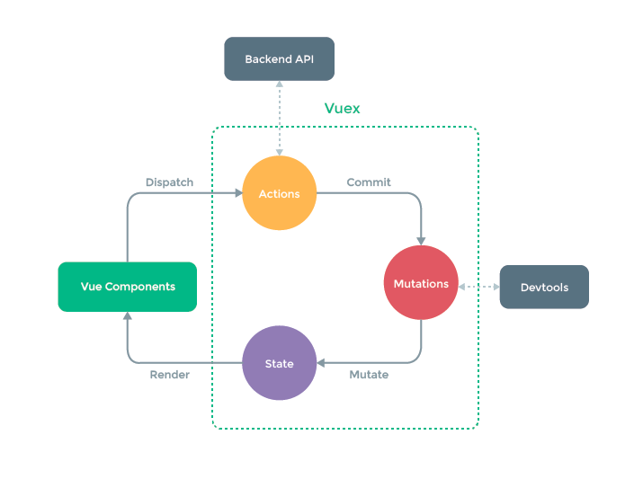

# Vuex

> 상태관리 패턴+라이브러리.
>
> 앱의 모든 컴포넌트에 대한 중앙집중식 저장소 역할을 한다.
>
> 각 컴포넌트에서 중앙집중 저장소의 state만 신경쓰면 되므로, 규모가 큰 프로젝트에서 효율적임

### 1️⃣ Vuex의 흐름

#### 1. State : 중앙에서 관리하는 모든 상태 정보 (data)

- 여러 컴포넌트 내부에 있는 특정 state를 **중앙**에서 관리하게 됨. 각 컴포넌트는 store에서 state 정보를 가져와서 사용한다.
- state가 변화하면 **해당 state를 공유하는 여러 컴포넌트의 DOM은 알아서 랜더링**

#### 2. Mutations : 실제로 state를 변경하는 유일한 방법

- handler 함수는 반드시 동기적이어야 한다. 비동기적 로직은 state가 변화하는 시점이 의도한 것과 달라질 수 있으며, 콜백이 실제로 호출 될 시기를 알 수 있는 방법이 없기 때문
- **첫번째 인자**로 항상 **state**를 받으며, **Action에서 commit() 메서드에 의해 호출**됨

#### 3. Actions : state를 직접 변경하는 대신 commit() 메서드를 통해 mutation을 호출해서 실행함

- 비동기 작업이 포함될 수 있음
- **context 객체 인자를 받아서**, context 객체를 통해 **tore/index.js 파일 내에 있는 모든 요소의 속성에 접근하거나 메서드 호출이 가능**하다. 
- **컴포넌트**에서 **dispatch() 메서드에 의해 호출**됨.

#### 4. Getters : state를 변경하지 않고 활용하여 계산을 수행함(computed 속성과 유사)

- 저장소의 state(상태)를 기준으로 계산한다. 예를 들어, state에 todoList라는 목록이 있을 경우, 완료된 todo 목록만을 필터링해서 출력해야 하는 경우 사용함.
- 계산된 값을 **가져올 뿐**, 직접 state를 변경하지는 않는다.

