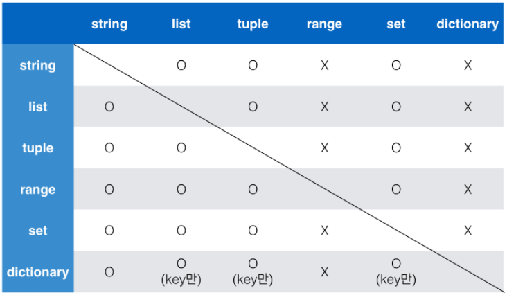

1. Python 기초


### 들여쓰기(Indentation)

> space 4칸으로 들여쓰기


### 변수(Variable)

> 컴퓨터 메모리 어딘가에 저장되어 있는 객체를 참고하기 위해 사용되는 이름
>
> > 객체(object) : 숫자, 문자, 클래스 등 값을 가지고 있는 모든 것. 파이썬은 객체지향 언어이다.
> >
> > 동일 변수에 언제든 다른 객체 할당 가능. (박스에 값을 저장한다고 생각하기)


#### (1) 할당 연산자(Assignment Operator) : ==

- 변수는 = 를 통해 할당된다.

- type() : 해당 타입 확인 / id() : 해당 값의 메모리 주소 확인

- 두개의 변수에 값들을 동시에 할당 가능. 

  - 단, 두개의 변수에 하나의 값을 할당하거나, 변수 갯수보다 더 많은 값을 할당하면 오류 발생

  ```python
  x,y = 1,2
  print(x,y) # 1 2
  
  x,y = 1
  print(x,y) # TypeError
  
  x,y = 1,2,3
  print(x,y) # ValueError
  ```

  

#### (2) 식별자(Identifiers) : 변수, 함수, 모듈, 클래스 등을 식별하는데 사용되는 이름

- 식별자의 이름은 알파벳, 언더스코어, 숫자로 구성된다.

- 첫 글자에 숫자가 올 수 없다.

- 대/소문자 구별

- 예약어는 식별자로 사용될 수 없음

  ```python
  # 사용할 수 없는 식별자 리스트 (예약어)
  import keyword
  print(keyword.kwlist)
  #['False', 'None', 'True', '__peg_parser__', 'and', 'as', 'assert', 'async', 'await', 'break', 'class', 'continue', 'def', 'del', 'elif', 'else', 'except', 'finally', 'for', 'from', 'global', 'if', 'import', 'in', 'is', 'lambda', 'nonlocal', 'not', 'or', 'pass', 'raise', 'return', 'try', 'while', 'with', 'yield']
  ```

  

#### (3) 사용자 입력(input) : 기본으로 문자열 형태로 반환됨


#### (4) 주석(Comment) : 

- \# 으로 표현한다
- 여러 줄의 주석은 ''' 또는 """ 으로 표현 가능 (주로 함수/클래스를 설명)


### 자료형 (Data Type)

> 불린형, 수치형(정수, 부동소수점, 복소수), 문자열, None(값이 없음)


#### (1) 불린형(Boolean Type)

- True/False 값 반환. 비교, 논리연산 수행

- 0, 0.0, (), [], {}, '', None 은 False 반환


#### (2) 수치형(Numerit Type)

1.  정수(Int, Interger) : 8진수, 2진수, 16진수 로도 표현 가능(각 0o,0b,0x)

   - 파이썬에서 표현할 수 있는 가장 큰 수 (sys모듈을 통해 불러오기)
   - 정수자료형에서 오버플로우가 없음. 임의 정밀도 산술 사용하기 때문

2. 부동소수점(float, floating point number, 실수)

   - 항상 같은 값으로 일치되지 않음 - 컴퓨터가 2진수로 숫자를 표현하는 과정에서 생기는 오류. 

     값 비교 시 주의하기

     - 차이가 매우 작은 수거나, sys 모듈의 epsilon을 사용하거나, math.isclose 사용하기

3. 복소수(comlpex, complex number) : 실수부와 허수부(j)를 가짐


#### (3) 문자열(String Type)

> ''나 ""을 활용하여 표현하기. 단 문자열을 묶을때는 동일한 문장부호 사용하기

- 문자열을 변경할 수 없음 (Immutable)

- 문자열 순회 가능 (iterable)

- 이스케이프 시퀀스

  ```bash
  \n : 줄바꿈
  \t : 탭(띄어쓰기)
  \\ : \ 를 문자로 쓰고싶을 때
  \' : ' 를 쓰고싶을때
  \" : " 를 쓰고싶을때
  ```

- String interpolation

  ```bash
  1. % - formatting (잘 안씀)
  2. str.format()
  print('{0}'.format(name))
  3. f-string
  print('{name}') (주로 f-string으로 쓰기)
  ```

  


### 컨테이너(Container)

> 여러 개의 값을 지정할 수 있는 것을 의미. 서로 다른 자료형을 저장할 수 있음.


#### (1) 컨테이너 분류 (시퀀스 / 비시퀀스)

- 시퀀스 : 순서가 있는(ordered) 데이터
- 비시퀀스 : 순서가 없는(unordered) 데이터


#### (2) 시퀀스(sequence)형 컨테이너

> 데이터가 순서대로 나열된 형식. 정렬되었다(sorted) 라는 뜻은 아님

- 특징
  - 순서가 있음
  - 특정 위치의 데이터를 가리킬 수 있다. (인덱싱)


- 리스트 (List)

  - [], list() 를 통해 만들 수 있다.

  - list[i] 방식으로 접근 가능

    ```python
    boxes = ['a', 'b',['apple','banana','cherry']]
    
    boxes[2]             # ['apple','banana','cherry']
    boxes[-1]            # ['apple','banana','cherry']
    boxes[-1][-1]        # cherry
    ```

    

- 튜플(Tuple)

  - ()로 표현

  - 수정불가능(immutable)

  - 직접 사용하기 보단 파이썬 내부에서 다양한 용도로 활용됨(예를 들면 출력값)

    ```python
    # 요소가 하나인 튜플 만들기 (뒤에 콤마)
    
    my_tuple(1,) # (1,)
    my_tuple(1) # 1 타입 int
    ```

    

- 레인지(Range)

  - 정수의 시퀀스를 나타냄

    ```python
    # 기본형. 0부터 n-1
    range(n) 
    
    # 범위지정. n부터 m-1
    range(n, m)
    
    # 범위 및 스텝 지정. n부터 m-1까지 x만큼 증가
    range(n, m, x)
    ```


- 패킹/언패킹 연산자

  - 패킹

    - 매개변수에 *을 붙여 사용

    - 우변의 객체 수가 좌변의 변수 수보다 많을 때 순서대로 대입

    - 나머지 항목들은 모두 별 기호 표시된 변수에 리스트로 대입됨

      ```python
      x, *y = 1,2,3,4
      print(y)  # [2,3,4] 
      type(y)   # list
      ```

  - 언패킹

    - 인자 앞에 *을 붙여서 사용, 호출 시 인자를 해체하는 개념
    - 리스트로 대입됨

  

#### (3) 비시퀀스형 컨테이너

- 세트(Set)
  - 순서가 없고 중복이 없음. 중괄호{}를 통해 만든다.
  - 수학에서의 집합과 동일하게 처리됨. 
  - 수정 가능(mutable)
  - set()로 빈세트 만들기
  - 활용가능한 연산자
    - \- : 차집합
    - | : 합집합
    - & : 교집합
  - set를 활용하면 list의 중복값을 쉽게 제거할수 있지만, 순서가 보장이 안됨


- 딕셔너리(Dictionary)

  > key & value 쌍으로 이루어져 있음

  - {}를 통해 만들며, dict()로 만들 수 있다.
  - key는 immutable한 데이터만 가능 (string, integer, float, range, tuple, boolean)
    - 중복된 key는 존재할 수 없음
  - value는 list, dictionary 포함한 모든 것이 가능


#### (4) 형변환(Typecasting, Type conversion)

1.  암시적 형변환 : 사용자가 의도하지 않았지만, 파이썬에서 자동으로 형변환

   - bool, Numeric type에서만 가능

     ```python
     a = 3
     print(a+True)  # 4. True를 1로 자동 변환 (int+bool)
     ```


2. 명시적 형변환 : 위 상황 제외하고는 모두 명시적으로 형변환을 해주어야함

   - string -> integer : 형식에 맞는 숫자만 가능

   - integer -> string : 모두 가능

     ```python
     3+'2' #error
     str(3)+'2' #32
     ```




### 연산자(Operator)


#### (1) 산술 연산자

```bash
+ : 덧셈
- : 뺄셈
* : 곱셈
/ : 나눗셈      # 항상 float 반환
// : 몫        # 정수결과 반환
% : 나머지
** : 거듭제곱
```


#### (2) 비교 연산자

```bash
< : 미만
<= : 이하
> : 초과
>= : 이상
== : 같음
!= : 같지않음
is : 객체 아이덴티티
is not : 객체 아이덴티티가 아닌 경우
```


#### (3) 논리 연산자

```bash
a and b # a와 b가 모두 True일때만 True
a or b  # a와 b가 모두 False일때만 False
not a   # True->False, False->True
```

 - 단축평가 : 첫번째 값이 확실할때, 두번째 값은 확인하지 않는다.

   ```bash
   'a' and 'b' # b. 둘다 True일 경우에만 True이므로, a가 True여도 b값을 확인해야하기 때문에 b 반환
   'a' or 'b'  # a. 하나만 True여도 True이므로, a가 True이면 a값을 반환
   ```


#### (4) 복합 연산자

> 연산과 할당이 동시에 이루어짐. 반복문을 통해서 갯수를 카운트 할 때 주로 이용함

```bash
a += b # a = a+b
a -= b # a = a-b
```


#### (5) 식별 연산자

>  is 연산자를 통해 동일한 object인지 확인 가능 (예를 들어, 같은 id인지 확인할 때)


#### (6) 멤버십 연산자

> 요소가 시퀀스에 속해있는 지 확인. in / not in


#### (7) 시퀀스형 연산자

- 산술 연산자 (+) : 두 시퀀스를 연결

  ```python
  [1,2] + ['a'] # [1,2,'a']
  ```

- 반복 연산자 (*) : 시퀀스를 반복

  ```python
  (1,2)*3 # (1,2,1,2,1,2)
  ```

  

#### (8) 인덱스 슬라이싱

> [] 통해 값 접근, [:] 통해 슬라이싱

```python
[a:b]   # a부터 b-1까지
[:a]    # 0부터 a-1까지
[a:]    # a부터 끝까지
[a:b:c] # a부터 b까지 c간격으로
[::]    # 처음부터  끝까지
[::-1]  # 역순으로 처음부터 끝가지
```

