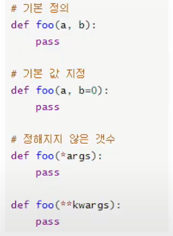

#  함수 (함수는 블랙박스이다.)

> 함수를 쓰는 이유 : 가독성, 재사용성, 유지보수

### 1. 함수 기초


#### (1) 함수의 정의



- 특정한 기능을 하는 코드의 조각(묶음)

- 매번 다시 작성하지 않고, 필요 시에만 호출하여 간편히 사용

- 사용자가 직접 함수 작성 가능 (사용 자함수-Customer Function)

  - ```python
    def function_name(parameter) :
        # code block
        return returnint_value
    ```

\* 알고리즘 문제 풀 때 len(), min(), max() 쓰지말기


#### (2) 함수의 기본 구조

- 선언과 호출

  - 함수는 함수명() 으로 호출
    - parameter가 있는 경우, 함수명(값1, 값2, ---) 로 호출

  ```python
  # 입력 받은 수를 세제곱하여 반환하는 함수 cube를 작성하기
  # 해당 함수를 활용하여 3의 세제곱, 20의 세제곱을 구하기
  
  def cube(a)
      return a ** 3
  
  print(cube(3))     # 결과값 27
  print(cube(20))    # 결과값 8000
  ```

  

- 함수의 결과값 (Output)

  - return을 만나면 함수는 종료됨 - return 두 번 사용 불가

    ```python
    def m(x,y) :
        return x - y     # 값을 두개 출력하고 싶지만
        return x * y     # 첫 번째 return에서 함수가 끝남. 값 -1
    --------------------
    # 하나의 return으로 두 개의 값을 반환하고 싶다면?
    
    def m(x,y) :
        return x-y, x*y
    
    print(m(2,1))       # (1,2) 의 1개의 튜플로 출력됨.
    
    ```

    > 주 의 - return vs print
    >
    > - return 은 함수 안에서만 사용되는 키워드
    > - print 는 출력을 위해 사용되는 함수 ( 값을 보기 위해서만 사용함 )  


- 함수의 입력(Input)

  - parameter와  Argument

    - Parameter는 함수를 실행할 때, 함수 내부에서 사용되는 식별자
    -  Argument는 함수를 호출할 때, 넣어주는 값 : 키워드 인자

  - 기본 인자값 : 함수를 <b>정의</b>할 때, 기본값을 지정하여 함수를 호출할 때 인자의 값을 설정하지 않도록 함. 정의된 것 보다 더 적은 개수의 인자들로 호출 될 수 있다.

    - 기본 인자값이 설정되어 있더라도 기존 함수와 동일하게 호출 가능

    - 기본 인자값을 가지는 인자 다음에 기본값이 없는 인자를 사용할 수 없다.

      ```python
      def inf(name='amy', age):
          return f'{name}은 {age}살입니다.'
      # SyntaxError: non-default argument follows default argument
      ```

  - 키워드 인자 : 함수를 <b>호출</b>할 때 키워드 인자를 활용하여 직접 변수의 이름으로 특정 인자를 전달한다.

    - 키워드인자 다음에 위치인자를 활용할 수 없다.

      ```python
      def inf(age, name):
          return f'{name}은 {age}살입니다.'
      
      inf(age=24, '철수')
      # SyntaxError: positional argument follows keyword argument
      ```

  - 정해지지 않은 여러개의 인자 처리

    - 가변 인자 리스트 : *args 사용. tuple형태로 처리가 된다.
    - 가변 키워드 인자 : **kwargs 사용. dict형태로 처리가 된다.


#### (3) 함수의 범위(Scope)

- 코드 내부 : <b>local scope</b>
  그 외의 공간 :  <b>global scope</b>

  ```python
  def ham()
      a = '소세지'
      
  print(a)       # Name Error : name 'a' is not defined
  ```

- 변수의 수명주기

  - 빌트인 스코프(built-in scope) : 파이썬이 실행된 이후부터 영원히 유지
  - 전역 스코프(global scope) : 모듈이 호출된 시점 이후 혹은 이름 선언된 이후부터 인터프리터가 끝날때 까지 유지
  - 지역(함수) 스코프(local scope) : 함수 호출 시 생성, 종료될 때까지 유지

- 이름 검색 규칙 : 파이썬에서 사용되는 이름(식별자)들은 이름공간에 저장되어 있다.
  아래 순서대로 이름을 찾아 나가며, 이를 <b>LEGB Rule</b>이라고 부름.

  - Local scope : 함수
  - Enclosed scope : 특정 함수의 상위 함수
  - Global scope : 함수 밖의 변수 혹은 import 된 모듈
  - Built-in scope : 파이썬 안에 내장되어 있는 함수 혹은 속성


#### (4) 함수의 문서화

- <b>Docstring (Document String)</b> - Jupyter notebook에서 함수에 커서를 놓고 shift+tab 참고하기

- <b>Naming Convention</b>

  - 좋은 함수와 parameter 이름을 짓는 방법

    - 상수 이름은 영문 전체를 대문자로

    - 클래스 및 예외의 이름은 각 단어의 첫 글자만 영문 대문자로

    - 이외 나머지는 소문자 또는 밑줄로 구분한 소문자 사용하기 -> 함수

      - 예를 들면

       ```python
       student = '누구'
       students = [''. '']   # 리스트 이름은 복수형으로 짓기
       ```

      

  - 스스로를 설명

    - 함수의 이름만으로 어떤 역할을 하는 함수인지 파악 가능해야함
    - 어떤 기능을 수행하는지, 결과 값으로 무엇을 반환하는지 등..


#### (5) 내장 함수(Built-in Functions)

 : 파이썬 인터프리터 참고

- <b>map</b> (function - 각 함수에 적용하고싶은 이름 넣기, iterable)

- <b>filter</b> (function, iterable) - iterable(순회가능한 데이터구조)에 function(함수)를 적용하고,

  ​                                               그 결과가 <b>True</b>인 것들을 filter object로 반환

- <b>zip</b>(*iterables) - 복수의 iterable을 모아 튜플을 원소로 하는 zip object를 반환

- <b>lamda [parameter] : 표현식</b> => 표현식을 계산한 결과값을 반환하는 함수. 

  ​                                                          이름 없는 함수여서 익명함수라고 불림

- <b>재귀 함수</b>

  - 자기 자신을 호출하는 함수

  - 1개 이상의 <b>base case(종료되는 상황)</b>가 존재하고, 무한한 호출이 아닌 수렴하도록 작성

    ```python
    def f(n) :
        if n==0 or n==1 :
            return 1
        else : 
            return n * f(n-1)
       
    f(4)
    ```

  - 호출 횟수가 1,000번 넘어가면 작동하지 않음 (Python에서)

  - 반복문과의 차이

    - 알고리즘 자체가 재귀적인 표현이 자연스러운 경우 재귀함수 사용
    - 재귀 호출은 변수 사용을 줄여줄 수 있다
    - 재귀 호출은 입력값이 커질 수록 연산속도가 오래걸림


# 모듈 

#### (1) 모듈과 패키지

- 모듈 : 특정 기능을 하는 코드를 파이썬 파일(.py) 단위로 작성한 것

- 패키지 : 여러 모듈의 집합. 

  \* 모듈과 패키지는 혼동해서 사용하기도 함.

- 모듈과 패키지 불러오기

  ```python
  import module               
  from package import module
  ```


#### (2) 파이썬 표준 라이브러리 (PSL)

- 파이썬에 기본적으로 설치된 모듈과 내장함수
  -  https://docs.python.org/ko/3/library/index.html
